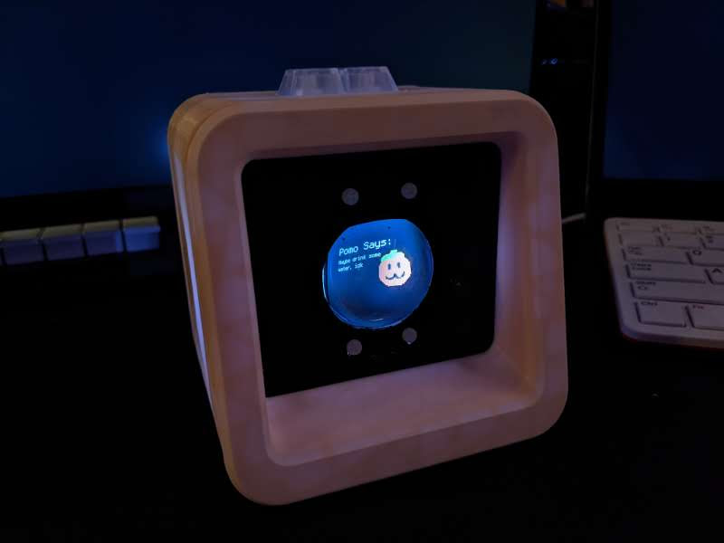
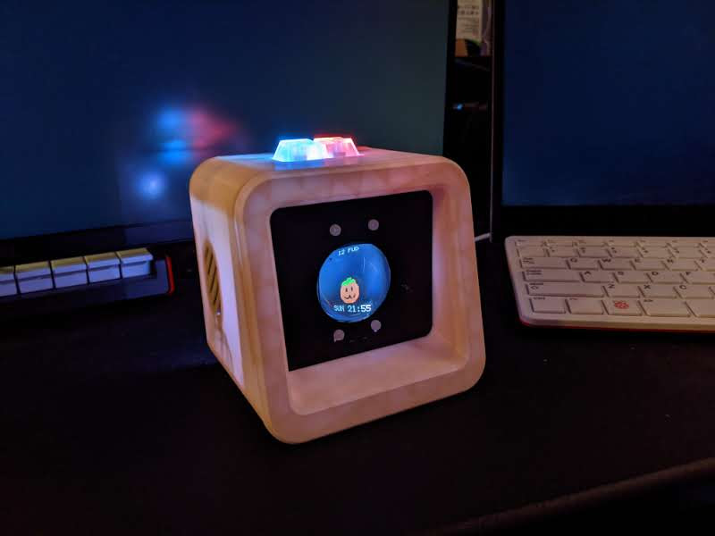
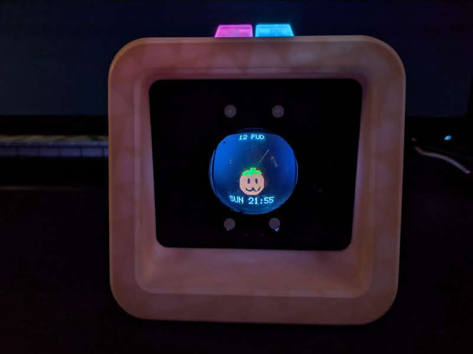

# Pomodachi: A Hardware Pomodoro Timer Virtual Pet

## What?
Pomo is a cute little buddy on your desk to help motivate you to work hard in concentrated bursts of productivity with small breaks in between. Feed Pomo by completing a set of timed work legs in a row. Give him food during downtime. Keep up a configurable goal rate of work for Pomo to keep him healthy.

Don't worry about tracking a clock; Pomo will let you know when it is time to take a break, suggest an activity, and let you know when to get back started. The only thing you need to do is press and hold the buttons to let Pomo know you are ready.

## Why?
Like many, I had to work remote starting with the pandemic, and had a little bit of difficulty keeping myself focused on a task at hand. I turned to the Pomodoro Technique, but had trouble because it felt artificial and self imposed at times. Pomodachi hopes to solve that in a few ways:

* Make it fun: Pomodachi should give a fun little way to flavor and motivate productive time without being overly gamified.
* Make it low impact: Pomodoro is about inducing flow, and the awareness of the state of timers can be a distraction. Pomo abstracts away the need to know the exact state of your timers during work time, letting you focus on the present.
* Make it hackable: I'm learning a lot of stuff myself in the process of making this, so I picked parts and make choices that hopefully make the project accessible to any re-implementers.

## How?
### User Experience
On boot we see Pomo, a small clock in the upper left corner, and a food count upper right corner. Press either button alone to feed Pomo.

When you run out of food, Pomo will need to go exploring for new food. Press and hold both buttons down to start a Pomodoro session, Pomo will leave to search for food until break time where Pomo will return with a suggested break activity. 

Press either button to start the break, and then again when the break ends to start the next leg of the Pomodoro and so on until all legs are completed to get the session reward.

Based on a configurable daily eating rate, Pomo will need food to survive. Fall behind your goals and low on food? If Pomo is very hungry, it will feed a multiplier to restore health so you will always be able to recover from dips in productivity.

**TIP: If the key buttons are lit up, holding both down will move you to the next phase.**

### Configuration:
As of now all configuration is a set of constants at the top of the python file but configurable is:

* `length_of_leg` - How long a leg of a session is in minutes (`default: 20`)
* `length_of_break` - How long breaks are in minutes (`default: 5`)
* `legs_in_session` - Number of legs in a Pomodoro session (`default: 4`)
* `food_for_leg` - Food gained in each leg of a Pomodoro (`default: 1`)
* `food_for_session` - Food gained in the completion ofa full Pomodoro set (`default: 4`)
* `session_rewards` - Automatically calculated from `(food_for_leg * legs_in_session + food_for_session)`
* `eating_rate[day]` - (day is Sun-Sat mapped to 0-6) Effectively a per day Pomodoro goal. Will auto calculate from food rewards as eating_rate[day] * session_rewards (`default: (0, 1, 2, 2, 2, 0, 0)`)
* `difficulty` - This number is equal to the running eating rate that causes death. In units of `session_rewards` Increase to make more forgiving, decrease all the way to 1 to require every session every day (`default: 7`)
* `hunger_multiplier` - If hunger is negative, food will perform a multiplier amount to allow for catching up. (`default: 3`)

## Bill of Materials:
* 1x HalloWing M4 Express - [$39.95 @ Adafruit](https://www.adafruit.com/product/4300)  

The core of the build with the display, processing and connectivity all coming from here.

* 1x Neokey 2 FeatherWing - [$4.50 @ Adafruit](https://www.adafruit.com/product/4979)
* 1x Mini Oval 1W 8 OHM Speaker - [$1.95 @ Adafruit](https://www.adafruit.com/product/3923)
* 2x Kaith Mechanical Keys, White - [$6.95 @ Adafruit](https://www.adafruit.com/product/4955)
* 2x Translucent MX Keycaps - [$4.95 @ Adafruit](https://www.adafruit.com/product/4956)  

A little speaker and a pair of tactile mechanical keyboard keys for I/O. Chosen as the Pomodoro technique requires a distinct sensory experience when setting a timer to work most effectively. The speaker allows for ~~annoying alarms~~ cute sounds (but not being used right now :( ).

* 1x Adafruit PCF8523 Real Time Clock Assembled Breakout Board - [$4.95 @ Adafruit](https://www.adafruit.com/product/3295)
* 1x CR1220 12mm Diameter - 3V Lithium Coin Cell Battery - [$0.95 @ Adafruit](https://www.adafruit.com/product/380)  

Virtual pets need an RTC to allow for accurate time telling, and tracking time differences between boots

* 1x Enclosure, 3D printed from primarily [Hatchbox PLA, Beige](https://www.hatchbox3d.com/collections/pla/products/3d-pla-1kg1-75-720c) and [eSun PLA+, Black](https://www.esun3d.net/products/142.html) for the face panel
* 1x Convex Glass Lens with Edge - 40mm Diameter - [$5.95 @Adafruit](https://www.adafruit.com/product/3853)
* 1x Clear Acrylic Lens Holder + Hardware Kit for HalloWing (we use the screws and spacers for mounting) - [$2.95 @ Adafruit](https://www.adafruit.com/product/4013)
* Various Metric Screw hardware TBD  

The enclosure gives this project all of its personality. The PyPortal-based case makes way for a convex glass lens that gives a nice retro effect.

* 1x Micro-USB Cable - [$4.95 @ Adafruit](https://www.adafruit.com/product/2185)
* Male-to-Female Jumpers (or other sufficient wiring) [$3.95 @ Adafruit](https://www.adafruit.com/product/825)
* 1x Lithium Ion Polymer Battery - 3.7v 500mAh - [$7.95 @ Adafruit](https://www.adafruit.com/product/1578)  

Battery is optional but it adds weight and allows for off the desk use for short periods of time.

Total: Around $125-175 depending on what you have on hand in terms of metric screws, filament, etc.

## Roadmap
### Immediate
* Persistent Storage to hold state between boots.
* Total Refactor out of this Prototype/Proof of Concept Code
* Implement a "first boot" to allow time setting from the main file itself.

### Ideas Going Forward
* Setting Time and other setting in runtime. Integrate with first boot.
* Increase Tactile Response of setting the timer with a haptic motor.
* Portable Enclosure
* Implement preferred work times where Pomo reminds the user to start a set.
* Create more virtual pet style features such as development, and growth.
* More Virtual Pet interactions (make use of the accelerometer, the touch analog connections?).

## Licenses
* Code is by droxpopuli under the MIT Licence.  
* Runtime and Library is by Adafruit under the MIT Licence.  
* Art and Audio is by droxpopuli, under CC BY 4.0.  
* Enclosure is a modification of the PyPortal Retro Cases from Adafruit by droxpopuli, both under CC BY 4.0.

## Images

